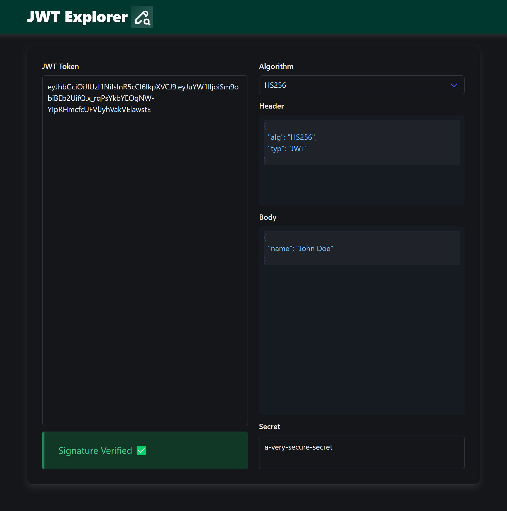

# JWT Explorer

## About

A clone of [jwt.io](https://jwt.io/) - decode/encode JWTs using this tool.

[Check it out here](https://eatmygoose.github.io/JWT-Explorer/index.html)

## Features
- Runs completely client-side as a SPA (i.e. **no data** is transmitted out of the webpage)
- Support for the following encryption algorithms (a.k.a most algorithms supported by the `jose` library)
  - Note that public & private keys must be in `SPKI` & `PCKS8` formats respectively for asymmetric algorithms

  |JWS Algorithm|
  |---|
  |ES256, ES384, ES512|
  |HS256, HS384, HS512|
  |PS256, PS384, PS512|
  |RS256, RS384, RS512|
